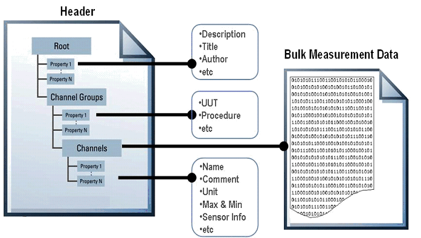
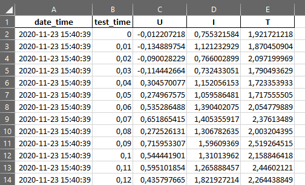
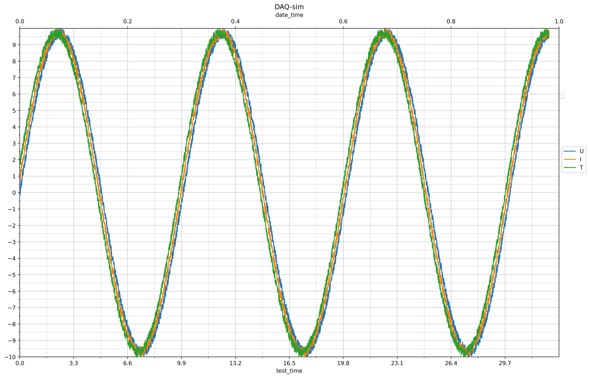

# npTDMS
scripts for automaticaly reading tdms log files and converting them to excel or png pictures for report generation

## Procedure

1. Stream document to numpy data buffer, with progress bar
2. Convert signal_data numpy to dataframe
3. Concatenate date_time, test_time, signal_data to dataframe
4. Dataframe export to excel
5. Dataframe export to png
